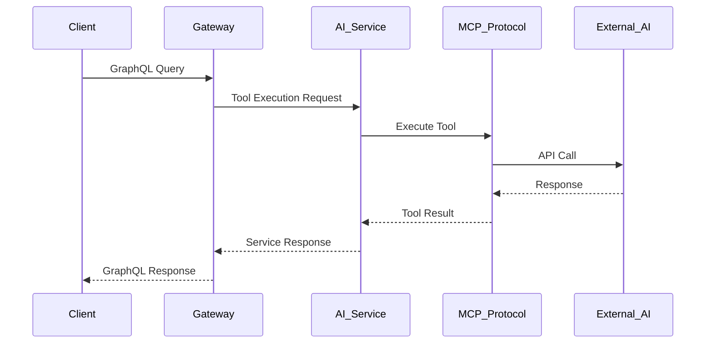

# 🚀 Microservice MCP GraphQL Backend

Dự án backend được refactor từ kiến trúc monolithic sang kiến trúc microservice với GraphQL và chuẩn MCP (Model Context Protocol). Dự án này cung cấp một nền tảng mạnh mẽ cho việc xây dựng các ứng dụng AI/ML với khả năng mở rộng cao.

## 📋 Mục lục

- [🏗️ Kiến trúc dự án](#-kiến-trúc-dự-án)
- [🤖 MCP Protocol Architecture](#-mcp-protocol-architecture)
- [🔧 Cách phát triển API](#-cách-phát-triển-api)
- [🚀 Cài đặt và chạy](#-cài-đặt-và-chạy)
- [📡 API Endpoints](#-api-endpoints)
- [🔐 Authentication & Authorization](#-authentication--authorization)
- [📊 Monitoring & Health Checks](#-monitoring--health-checks)
- [🧪 Testing](#-testing)
- [📚 Documentation](#-documentation)

## 🏗️ Kiến trúc dự án

### Tổng quan kiến trúc

```
┌─────────────────────────────────────────────────────────────────┐
│                        Client Layer                            │
│  ┌─────────────┐  ┌─────────────┐  ┌─────────────────────────┐ │
│  │ Web App     │  │ Mobile App │  │ Third-party Services    │ │
│  └─────────────┘  └─────────────┘  └─────────────────────────┘ │
└─────────────────────────┬───────────────────────────────────────┘
                          │
                    ┌─────▼─────┐
                    │ API Gateway│ ← GraphQL + REST API
                    │ (Port 4000)│
                    └─────┬─────┘
                          │
                    ┌─────▼─────┐
                    │Orchestrator│ ← Service Management
                    │(Port 4006)│
                    └─────┬─────┘
                          │
    ┌─────────────────────┼─────────────────────┐
    │                     │                     │
┌───▼────┐ ┌─────────────▼─────────┐ ┌────────▼────────┐
│ Gateway│ │      Core Services    │ │  Support Services│
│ Routes │ │                       │ │                 │
└────────┘ └───────────────────────┘ └─────────────────┘
                    │
    ┌───────────────┼───────────────┐
    │               │               │
┌───▼────┐ ┌───────▼──────┐ ┌──────▼──────┐
│ Auth   │ │ AI Service   │ │ Media       │
│Service │ │ (MCP)        │ │ Service     │
│4001    │ │ 4002         │ │ 4003        │
└────────┘ └──────────────┘ └─────────────┘
    │               │               │
┌───▼────┐ ┌───────▼──────┐ ┌──────▼──────┐
│ User   │ │ Notification │ │ Orchestrator│
│Service │ │ Service      │ │ Components  │
│4004    │ │ 4005         │ │             │
└────────┘ └──────────────┘ └─────────────┘
```

### Microservices Architecture

#### 1. **API Gateway** (Port 4000)
- **Chức năng**: Entry point chính, routing, GraphQL resolver
- **Công nghệ**: Express.js, Apollo Server, GraphQL
- **Đặc điểm**: 
  - GraphQL schema unification
  - Request routing và load balancing
  - Authentication middleware
  - Rate limiting và security

#### 2. **Service Orchestrator** (Port 4006) ⭐ **NEW**
- **Chức năng**: Quản lý và điều phối tất cả microservices
- **Components**:
  - **Service Registry**: Đăng ký và discovery services
  - **Load Balancer**: Phân phối tải giữa instances
  - **Circuit Breaker**: Xử lý lỗi và fallback
  - **Health Monitor**: Theo dõi sức khỏe services
  - **Config Manager**: Quản lý cấu hình tập trung
  - **Metrics Collector**: Thu thập metrics

#### 3. **Auth Service** (Port 4001)
- **Chức năng**: Xác thực, phân quyền, quản lý user
- **Công nghệ**: JWT, bcrypt, Redis session
- **Features**: 
  - JWT token management
  - Role-based access control (RBAC)
  - Session management
  - Password hashing

#### 4. **AI Service** (Port 4002) 🧠 **CORE**
- **Chức năng**: Xử lý AI/ML với MCP protocol
- **Công nghệ**: OpenAI, Google AI, HuggingFace, Qdrant
- **MCP Protocol**: 
  - Tool execution
  - Resource management
  - Prompt templates
  - Vector search

#### 5. **Media Service** (Port 4003)
- **Chức năng**: Xử lý file, media conversion
- **Công nghệ**: Sharp, FFmpeg, PDF-parse
- **Features**:
  - Image processing (resize, crop, filter)
  - Video processing (transcode, extract frames)
  - PDF processing (text extraction, parsing)
  - File upload/download

#### 6. **User Service** (Port 4004)
- **Chức năng**: Quản lý user profiles, preferences
- **Features**:
  - User CRUD operations
  - Profile management
  - Preferences storage
  - User analytics

#### 7. **Notification Service** (Port 4005)
- **Chức năng**: Email, push notifications, alerts
- **Công nghệ**: Nodemailer, Socket.IO
- **Features**:
  - Email templates
  - Push notifications
  - Real-time alerts
  - Notification preferences

### Database & Infrastructure

#### **MongoDB** (Port 27017)
- **Chức năng**: Primary database
- **Collections**: Users, AI_Requests, Media_Files, Notifications
- **Features**: 
  - Document-based storage
  - Indexing và aggregation
  - Replica sets (production)
  - Sharding support

#### **Redis** (Port 6379)
- **Chức năng**: Cache, session storage, pub/sub
- **Features**:
  - Session management
  - API response caching
  - Rate limiting
  - Real-time communication

#### **Qdrant Vector Database** (Port 6333)
- **Chức năng**: Vector storage cho AI embeddings
- **Collections**: 
  - `documents`: Document embeddings (1536 dimensions)
  - `images`: Image embeddings (512 dimensions)
  - `audio`: Audio embeddings (1024 dimensions)
  - `code`: Code embeddings (768 dimensions)

### Communication Patterns

#### **Synchronous Communication**
- **REST API**: Service-to-service communication
- **GraphQL**: Client-to-Gateway communication
- **HTTP/HTTPS**: Standard web protocols

#### **Asynchronous Communication**
- **Socket.IO**: Real-time updates
- **Redis Pub/Sub**: Event-driven communication
- **Message Queues**: Background job processing

## 🤖 MCP Protocol Architecture

### MCP (Model Context Protocol) là gì?

**MCP (Model Context Protocol)** là một chuẩn mở cho phép AI models tương tác với external tools, resources và data sources một cách an toàn và có cấu trúc.

### Kiến trúc MCP trong dự án

```
┌─────────────────────────────────────────────────────────────┐
│                    MCP Protocol Layer                      │
├─────────────────────────────────────────────────────────────┤
│  ┌─────────────┐  ┌─────────────┐  ┌─────────────────────┐ │
│  │   Tools     │  │  Resources  │  │      Prompts        │ │
│  │             │  │             │  │                     │ │
│  │ • Text Gen  │  │ • AI Models │  │ • System Prompts    │ │
│  │ • Image Gen │  │ • Vectors   │  │ • Creative Writing  │ │
│  │ • Speech    │  │ • Capabilities│ │ • Code Assistant    │ │
│  │ • Translation│ │             │  │                     │ │
│  └─────────────┘  └─────────────┘  └─────────────────────┘ │
└─────────────────────────┬───────────────────────────────────┘
                          │
                    ┌─────▼─────┐
                    │ AI Service │ ← MCP Implementation
                    │ (Port 4002)│
                    └─────┬─────┘
                          │
    ┌─────────────────────┼─────────────────────┐
    │                     │                     │
┌───▼────┐ ┌─────────────▼─────────┐ ┌────────▼────────┐
│ OpenAI │ │    Google AI          │ │   HuggingFace   │
│ API    │ │   (Gemini)            │ │   API           │
└────────┘ └───────────────────────┘ └─────────────────┘
```

### MCP Components

#### 1. **Tools (Công cụ)**

```javascript
// MCP Tools Definition
const tools = {
  text_generation: {
    name: 'text_generation',
    description: 'Generate text using various AI models',
    inputSchema: {
      type: 'object',
      properties: {
        prompt: { type: 'string', description: 'Input prompt' },
        model: { type: 'string', enum: ['gpt-4', 'gpt-3.5-turbo', 'gemini-pro'] },
        maxTokens: { type: 'number', description: 'Max tokens' },
        temperature: { type: 'number', description: 'Creativity level' }
      },
      required: ['prompt']
    }
  },
  
  image_generation: {
    name: 'image_generation',
    description: 'Generate images using AI models',
    inputSchema: {
      type: 'object',
      properties: {
        prompt: { type: 'string', description: 'Image description' },
        size: { type: 'string', enum: ['256x256', '512x512', '1024x1024'] },
        quality: { type: 'string', enum: ['standard', 'hd'] }
      },
      required: ['prompt']
    }
  }
};
```

#### 2. **Resources (Tài nguyên)**

```javascript
// MCP Resources
const resources = {
  ai_models: {
    name: 'ai_models',
    description: 'Available AI models for various tasks',
    uri: 'mcp://ai-service/models',
    mimeType: 'application/json',
    data: {
      text_generation: ['gpt-4', 'gpt-3.5-turbo', 'gemini-pro', 'claude-3'],
      image_generation: ['dall-e-3', 'midjourney', 'stable-diffusion'],
      speech_recognition: ['whisper-1', 'google-speech'],
      translation: ['google-translate', 'deepl', 'openai-translate']
    }
  },
  
  vector_collections: {
    name: 'vector_collections',
    description: 'Available vector collections for similarity search',
    uri: 'mcp://ai-service/collections',
    mimeType: 'application/json',
    data: {
      documents: 'Document embeddings for semantic search',
      images: 'Image embeddings for visual similarity',
      audio: 'Audio embeddings for audio similarity',
      code: 'Code embeddings for code similarity'
    }
  }
};
```

#### 3. **Prompts (Mẫu câu)**

```javascript
// MCP Prompts
const prompts = {
  system_prompt: {
    name: 'system_prompt',
    description: 'System prompt for AI interactions',
    prompt: `You are an AI assistant with access to various tools and resources. 
    You can help with text generation, image creation, document processing, and more.
    Always provide helpful and accurate responses.`
  },
  
  creative_writing: {
    name: 'creative_writing',
    description: 'Prompt template for creative writing tasks',
    prompt: `You are a creative writer. Help the user with their writing task.
    Consider the context, tone, and style requested.`
  },
  
  code_assistant: {
    name: 'code_assistant',
    description: 'Prompt template for coding assistance',
    prompt: `You are a coding assistant. Help the user with their programming task.
    Provide clear, well-documented code examples and explanations.`
  }
};
```

### MCP Tool Execution Flow



### MCP API Endpoints

#### **Tools Management**
```bash
# Get available tools
GET /mcp/tools

# Execute a tool
POST /mcp/tools/execute
{
  "tool": "text_generation",
  "parameters": {
    "prompt": "Write a story about AI",
    "model": "gpt-4",
    "maxTokens": 500
  }
}

# Get tool schema
GET /mcp/tools/{toolName}/schema
```

#### **Resources Management**
```bash
# Get available resources
GET /mcp/resources

# Get specific resource
GET /mcp/resources/{resourceName}

# Update resource
PUT /mcp/resources/{resourceName}
```

#### **Prompts Management**
```bash
# Get available prompts
GET /mcp/prompts

# Get specific prompt
GET /mcp/prompts/{promptName}

# Create new prompt
POST /mcp/prompts
{
  "name": "custom_prompt",
  "description": "Custom prompt template",
  "prompt": "Custom prompt content..."
}
```

## 🔧 Cách phát triển API

### 1. **Tạo GraphQL Schema**

```javascript
// services/gateway/src/graphql/schema.js
const { gql } = require('apollo-server-express');

const typeDefs = gql`
  # Define your types
  type User {
    id: ID!
    email: String!
    username: String!
    role: UserRole!
    createdAt: String!
  }

  enum UserRole {
    USER
    ADMIN
    MODERATOR
  }

  # Queries
  type Query {
    me: User
    user(id: ID!): User
    users(limit: Int, offset: Int): [User!]!
  }

  # Mutations
  type Mutation {
    createUser(input: CreateUserInput!): User!
    updateUser(id: ID!, input: UpdateUserInput!): User!
    deleteUser(id: ID!): Boolean!
  }

  # Input types
  input CreateUserInput {
    email: String!
    username: String!
    password: String!
    role: UserRole
  }

  input UpdateUserInput {
    email: String
    username: String
    role: UserRole
  }
`;

module.exports = { typeDefs };
```

### 2. **Implement GraphQL Resolvers**

```javascript
// services/gateway/src/graphql/resolvers.js
const resolvers = {
  Query: {
    me: async (_, __, { user }) => {
      if (!user) throw new Error('Authentication required');
      return makeServiceRequest(USER_SERVICE_URL, `/users/${user.id}`);
    },

    user: async (_, { id }, { user }) => {
      if (!user) throw new Error('Authentication required');
      return makeServiceRequest(USER_SERVICE_URL, `/users/${id}`);
    },

    users: async (_, { limit = 10, offset = 0 }, { user }) => {
      if (!user) throw new Error('Authentication required');
      return makeServiceRequest(
        USER_SERVICE_URL, 
        `/users?limit=${limit}&offset=${offset}`
      );
    }
  },

  Mutation: {
    createUser: async (_, { input }, { user }) => {
      if (!user || user.role !== 'ADMIN') {
        throw new Error('Admin access required');
      }
      return makeServiceRequest(USER_SERVICE_URL, '/users', 'POST', input);
    },

    updateUser: async (_, { id, input }, { user }) => {
      if (!user) throw new Error('Authentication required');
      return makeServiceRequest(USER_SERVICE_URL, `/users/${id}`, 'PUT', input);
    },

    deleteUser: async (_, { id }, { user }) => {
      if (!user || user.role !== 'ADMIN') {
        throw new Error('Admin access required');
      }
      return makeServiceRequest(USER_SERVICE_URL, `/users/${id}`, 'DELETE');
    }
  }
};
```

### 3. **Tạo Microservice Controller**

```javascript
// services/user/src/controllers/userController.js
const User = require('../models/User');
const { validateUserInput } = require('../validators/userValidator');

class UserController {
  // Get all users with pagination
  async getUsers(req, res) {
    try {
      const { limit = 10, offset = 0, search } = req.query;
      
      let query = {};
      if (search) {
        query.$or = [
          { username: { $regex: search, $options: 'i' } },
          { email: { $regex: search, $options: 'i' } }
        ];
      }

      const users = await User.find(query)
        .limit(parseInt(limit))
        .skip(parseInt(offset))
        .select('-password')
        .sort({ createdAt: -1 });

      const total = await User.countDocuments(query);

      res.json({
        success: true,
        data: users,
        pagination: {
          limit: parseInt(limit),
          offset: parseInt(offset),
          total,
          hasMore: offset + users.length < total
        }
      });

    } catch (error) {
      res.status(500).json({
        success: false,
        error: error.message
      });
    }
  }

  // Get user by ID
  async getUserById(req, res) {
    try {
      const { id } = req.params;
      const user = await User.findById(id).select('-password');
      
      if (!user) {
        return res.status(404).json({
          success: false,
          error: 'User not found'
        });
      }

      res.json({
        success: true,
        data: user
      });

    } catch (error) {
      res.status(500).json({
        success: false,
        error: error.message
      });
    }
  }

  // Create new user
  async createUser(req, res) {
    try {
      const { error, value } = validateUserInput(req.body);
      if (error) {
        return res.status(400).json({
          success: false,
          error: error.details[0].message
        });
      }

      const user = new User(value);
      await user.save();

      res.status(201).json({
        success: true,
        data: user.toObject({ hide: 'password' })
      });

    } catch (error) {
      if (error.code === 11000) {
        return res.status(409).json({
          success: false,
          error: 'User already exists'
        });
      }

      res.status(500).json({
        success: false,
        error: error.message
      });
    }
  }

  // Update user
  async updateUser(req, res) {
    try {
      const { id } = req.params;
      const { error, value } = validateUserInput(req.body, true);
      
      if (error) {
        return res.status(400).json({
          success: false,
          error: error.details[0].message
        });
      }

      const user = await User.findByIdAndUpdate(
        id, 
        value, 
        { new: true, runValidators: true }
      ).select('-password');

      if (!user) {
        return res.status(404).json({
          success: false,
          error: 'User not found'
        });
      }

      res.json({
        success: true,
        data: user
      });

    } catch (error) {
      res.status(500).json({
        success: false,
        error: error.message
      });
    }
  }

  // Delete user
  async deleteUser(req, res) {
    try {
      const { id } = req.params;
      const user = await User.findByIdAndDelete(id);
      
      if (!user) {
        return res.status(404).json({
          success: false,
          error: 'User not found'
        });
      }

      res.json({
        success: true,
        message: 'User deleted successfully'
      });

    } catch (error) {
      res.status(500).json({
        success: false,
        error: error.message
      });
    }
  }
}

module.exports = new UserController();
```

### 4. **Tạo MongoDB Model**

```javascript
// services/user/src/models/User.js
const mongoose = require('mongoose');
const bcrypt = require('bcryptjs');

const userSchema = new mongoose.Schema({
  username: {
    type: String,
    required: [true, 'Username is required'],
    unique: true,
    trim: true,
    minlength: [3, 'Username must be at least 3 characters'],
    maxlength: [30, 'Username cannot exceed 30 characters']
  },
  
  email: {
    type: String,
    required: [true, 'Email is required'],
    unique: true,
    lowercase: true,
    trim: true,
    match: [/^\w+([.-]?\w+)*@\w+([.-]?\w+)*(\.\w{2,3})+$/, 'Please enter a valid email']
  },
  
  password: {
    type: String,
    required: [true, 'Password is required'],
    minlength: [6, 'Password must be at least 6 characters'],
    select: false
  },
  
  role: {
    type: String,
    enum: ['USER', 'MODERATOR', 'ADMIN'],
    default: 'USER'
  },
  
  firstName: {
    type: String,
    trim: true,
    maxlength: [50, 'First name cannot exceed 50 characters']
  },
  
  lastName: {
    type: String,
    trim: true,
    maxlength: [50, 'Last name cannot exceed 50 characters']
  },
  
  isActive: {
    type: Boolean,
    default: true
  },
  
  lastLogin: {
    type: Date
  },
  
  preferences: {
    theme: {
      type: String,
      enum: ['light', 'dark', 'auto'],
      default: 'auto'
    },
    language: {
      type: String,
      default: 'en'
    },
    notifications: {
      email: { type: Boolean, default: true },
      push: { type: Boolean, default: true }
    }
  }
}, {
  timestamps: true,
  toJSON: { virtuals: true },
  toObject: { virtuals: true }
});

// Virtual for full name
userSchema.virtual('fullName').get(function() {
  return `${this.firstName || ''} ${this.lastName || ''}`.trim();
});

// Pre-save middleware to hash password
userSchema.pre('save', async function(next) {
  if (!this.isModified('password')) return next();
  
  try {
    const salt = await bcrypt.genSalt(12);
    this.password = await bcrypt.hash(this.password, salt);
    next();
  } catch (error) {
    next(error);
  }
});

// Instance method to compare password
userSchema.methods.comparePassword = async function(candidatePassword) {
  return await bcrypt.compare(candidatePassword, this.password);
};

// Static method to find by email
userSchema.statics.findByEmail = function(email) {
  return this.findOne({ email: email.toLowerCase() });
};

// Indexes
userSchema.index({ email: 1 });
userSchema.index({ username: 1 });
userSchema.index({ role: 1 });
userSchema.index({ createdAt: -1 });

const User = mongoose.model('User', userSchema);

module.exports = User;
```

### 5. **Tạo Validation Schema**

```javascript
// services/user/src/validators/userValidator.js
const Joi = require('joi');

const createUserSchema = Joi.object({
  username: Joi.string()
    .min(3)
    .max(30)
    .pattern(/^[a-zA-Z0-9_]+$/)
    .required()
    .messages({
      'string.pattern.base': 'Username can only contain letters, numbers, and underscores',
      'string.min': 'Username must be at least 3 characters long',
      'string.max': 'Username cannot exceed 30 characters',
      'any.required': 'Username is required'
    }),

  email: Joi.string()
    .email()
    .required()
    .messages({
      'string.email': 'Please provide a valid email address',
      'any.required': 'Email is required'
    }),

  password: Joi.string()
    .min(6)
    .pattern(/^(?=.*[a-z])(?=.*[A-Z])(?=.*\d)/)
    .required()
    .messages({
      'string.pattern.base': 'Password must contain at least one lowercase letter, one uppercase letter, and one number',
      'string.min': 'Password must be at least 6 characters long',
      'any.required': 'Password is required'
    }),

  firstName: Joi.string()
    .max(50)
    .optional(),

  lastName: Joi.string()
    .max(50)
    .optional(),

  role: Joi.string()
    .valid('USER', 'MODERATOR', 'ADMIN')
    .default('USER')
    .optional(),

  preferences: Joi.object({
    theme: Joi.string()
      .valid('light', 'dark', 'auto')
      .default('auto'),
    
    language: Joi.string()
      .default('en'),
    
    notifications: Joi.object({
      email: Joi.boolean().default(true),
      push: Joi.boolean().default(true)
    })
  }).optional()
});

const updateUserSchema = Joi.object({
  username: Joi.string()
    .min(3)
    .max(30)
    .pattern(/^[a-zA-Z0-9_]+$/)
    .optional(),

  email: Joi.string()
    .email()
    .optional(),

  firstName: Joi.string()
    .max(50)
    .optional(),

  lastName: Joi.string()
    .max(50)
    .optional(),

  role: Joi.string()
    .valid('USER', 'MODERATOR', 'ADMIN')
    .optional(),

  isActive: Joi.boolean()
    .optional(),

  preferences: Joi.object({
    theme: Joi.string()
      .valid('light', 'dark', 'auto'),
    
    language: Joi.string(),
    
    notifications: Joi.object({
      email: Joi.boolean(),
      push: Joi.boolean()
    })
  }).optional()
});

const validateUserInput = (data, isUpdate = false) => {
  const schema = isUpdate ? updateUserSchema : createUserSchema;
  return schema.validate(data, { abortEarly: false });
};

module.exports = {
  validateUserInput,
  createUserSchema,
  updateUserSchema
};
```

### 6. **Tạo Routes**

```javascript
// services/user/src/routes/userRoutes.js
const express = require('express');
const router = express.Router();
const userController = require('../controllers/userController');
const { authenticateToken, authenticateRole } = require('../middleware/auth');
const { validateUserInput } = require('../validators/userValidator');

// Public routes (if any)
// router.get('/public/profile/:id', userController.getPublicProfile);

// Protected routes
router.use(authenticateToken);

// Get all users (Admin only)
router.get('/', 
  authenticateRole(['ADMIN', 'MODERATOR']), 
  userController.getUsers
);

// Get user by ID
router.get('/:id', userController.getUserById);

// Create new user (Admin only)
router.post('/', 
  authenticateRole(['ADMIN']), 
  userController.createUser
);

// Update user
router.put('/:id', 
  authenticateRole(['ADMIN', 'MODERATOR']), 
  userController.updateUser
);

// Delete user (Admin only)
router.delete('/:id', 
  authenticateRole(['ADMIN']), 
  userController.deleteUser
);

// User profile routes
router.get('/profile/me', userController.getMyProfile);
router.put('/profile/me', userController.updateMyProfile);
router.put('/profile/password', userController.changePassword);

module.exports = router;
```

## 🚀 Cài đặt và chạy

### Yêu cầu hệ thống
- Node.js 18+
- Docker & Docker Compose
- MongoDB 7.0+
- Redis 7.2+
- Qdrant Vector Database

### 1. **Clone repository**
```bash
git clone <repository-url>
cd microservice-MCP-graphql
```

### 2. **Cài đặt dependencies**
```bash
# Cài đặt dependencies cho tất cả services
npm install

# Hoặc cài đặt từng service riêng lẻ
cd services/gateway && npm install
cd ../auth && npm install
cd ../ai && npm install
cd ../media && npm install
cd ../user && npm install
cd ../notification && npm install
cd ../orchestrator && npm install
```

### 3. **Cấu hình môi trường**
```bash
# Copy file môi trường mẫu
cp env.example .env

# Chỉnh sửa các biến môi trường cần thiết
nano .env
```

### 4. **Chạy với Docker Compose**
```bash
# Khởi động tất cả services
docker-compose up -d

# Xem logs
docker-compose logs -f

# Dừng services
docker-compose down
```

### 5. **Chạy development mode**
```bash
# Chạy tất cả services
npm run dev

# Hoặc chạy từng service riêng lẻ
npm run dev:gateway
npm run dev:auth
npm run dev:ai
npm run dev:media
npm run dev:user
npm run dev:notification
npm run dev:orchestrator
```

## 📡 API Endpoints

### GraphQL (Gateway - Port 4000)
```
http://localhost:4000/graphql
```

### REST APIs
```
Gateway: http://localhost:4000
Auth: http://localhost:4001
AI: http://localhost:4002
Media: http://localhost:4003
User: http://localhost:4004
Notification: http://localhost:4005
Orchestrator: http://localhost:4006
```

### Health Checks
```
Gateway: http://localhost:4000/health
Auth: http://localhost:4001/health
AI: http://localhost:4002/health
Media: http://localhost:4003/health
User: http://localhost:4004/health
Notification: http://localhost:4005/health
Orchestrator: http://localhost:4006/health
```

## 🔐 Authentication & Authorization

### JWT Token Flow
1. **Đăng ký**: `POST /auth/register`
2. **Đăng nhập**: `POST /auth/login`
3. **Nhận token**: JWT access token + refresh token
4. **Sử dụng**: Header `Authorization: Bearer <token>`
5. **Refresh**: `POST /auth/refresh` khi token hết hạn

### Role-based Access Control (RBAC)
- **USER**: Quyền cơ bản, truy cập dữ liệu của mình
- **MODERATOR**: Quyền quản lý, có thể xem tất cả users
- **ADMIN**: Quyền toàn bộ hệ thống, CRUD operations

### Middleware Authentication
```javascript
// services/gateway/src/middleware/auth.js
const authenticateToken = async (req, res, next) => {
  try {
    const authHeader = req.headers['authorization'];
    const token = authHeader && authHeader.split(' ')[1];

    if (!token) {
      return res.status(401).json({ error: 'Access token required' });
    }

    // Verify JWT token
    jwt.verify(token, process.env.JWT_SECRET, (err, decoded) => {
      if (err) {
        if (err.name === 'TokenExpiredError') {
          return res.status(401).json({ error: 'Token expired' });
        }
        return res.status(401).json({ error: 'Invalid token' });
      }

      req.user = {
        id: decoded.userId,
        email: decoded.email,
        role: decoded.role,
        token: token
      };

      next();
    });
  } catch (error) {
    return res.status(500).json({ error: 'Authentication failed' });
  }
};
```

## 📊 Monitoring & Health Checks

### Health Check Endpoints
Mỗi service có health check endpoint riêng:

```javascript
// services/gateway/src/routes/health.js
router.get('/', (req, res) => {
  res.status(200).json({
    status: 'healthy',
    service: 'API Gateway',
    timestamp: new Date().toISOString(),
    uptime: process.uptime(),
    environment: process.env.NODE_ENV || 'development'
  });
});
```

### Orchestrator Health Monitoring
```javascript
// services/orchestrator/src/monitoring/healthMonitor.js
class HealthMonitor {
  async checkAllServices() {
    const services = await this.serviceRegistry.getAllServices();
    
    for (const service of services) {
      try {
        const health = await this.checkServiceHealth(service);
        await this.serviceRegistry.updateServiceHealth(service.id, health);
        
        // Emit real-time updates
        this.io.to('service_updates').emit('service_health_update', {
          serviceId: service.id,
          health: health
        });
      } catch (error) {
        logger.error(`Health check failed for ${service.name}:`, error);
      }
    }
  }
}
```

### Metrics Collection
```javascript
// services/orchestrator/src/metrics/metricsCollector.js
class MetricsCollector {
  async collectAllMetrics() {
    const services = await this.serviceRegistry.getAllServices();
    const metrics = {};

    for (const service of services) {
      try {
        const serviceMetrics = await this.collectServiceMetrics(service);
        metrics[service.id] = serviceMetrics;
      } catch (error) {
        logger.error(`Failed to collect metrics for ${service.name}:`, error);
      }
    }

    // Store metrics in Redis for historical analysis
    await this.storeMetrics(metrics);
    
    return metrics;
  }
}
```

## 🧪 Testing

### Unit Tests
```bash
npm test
```

### Integration Tests
```bash
# Test từng service
cd services/gateway && npm test
cd ../auth && npm test
cd ../ai && npm test
```

### API Testing với GraphQL
```graphql
# Test query
query {
  me {
    id
    email
    username
    role
  }
}

# Test mutation
mutation {
  createUser(input: {
    email: "test@example.com"
    username: "testuser"
    password: "password123"
  }) {
    id
    email
    username
  }
}
```

## 📚 Documentation

### API Documentation
- **GraphQL Schema**: Tự động generate từ Apollo Server
- **REST API**: Swagger/OpenAPI documentation
- **MCP Protocol**: Tool schemas và examples

### Code Documentation
- **JSDoc**: Function documentation
- **README**: Service-specific documentation
- **Architecture**: System design documents

### Development Guidelines
1. **Code Style**: ESLint + Prettier
2. **Git Flow**: Feature branches + PR reviews
3. **Testing**: Unit tests cho tất cả functions
4. **Documentation**: Update docs khi thay đổi API

---

## 🤝 Contributing

1. Fork repository
2. Tạo feature branch: `git checkout -b feature/amazing-feature`
3. Commit changes: `git commit -m 'Add amazing feature'`
4. Push to branch: `git push origin feature/amazing-feature`
5. Tạo Pull Request

## 📄 License

MIT License - xem file [LICENSE](LICENSE) để biết thêm chi tiết.

## 🆘 Support

- Tạo issue trên GitHub
- Liên hệ team development
- Xem documentation và examples

---

**Ready to build amazing applications! 🚀**
